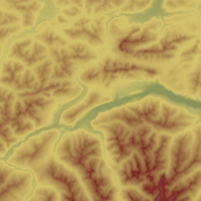

# Hypsometric Map

Convert terrarium encoded elevation tiles (left) to hypsometric tint tiles (right).




Preview with extra water layer and hillshading:


## Usage

1. Put (multiple) source files in ``data/terrarium`` e.g. ``data/terrarium/0/1/2.png`` where 0 is the zoom level, 1 is the x position and 2 the y position.

2. Run ``python3 converter.py`` from the root folder.

3. Find your converted tiles in ``data/hypsometric/..``.


## Challenges

As Mapbox does not support coloring raster tiles ([Issue 2889](https://github.com/mapbox/mapbox-gl-js/issues/3889)), we need to manually change colors to hypsometric and serve raster tiles which can be used as is.

How to encode different land properties like water, sand, ice and greens?


## Data Sources

[AWS for planet terrarium tiles from zoom 0 to 15](https://s3.amazonaws.com/elevation-tiles-prod/terrarium/{z}/{x}/{y}.png)

[Corresponding Git and Docs](https://github.com/tilezen/joerd/tree/master/docs)

Excerpt can be found in ``data/terrarium``.

[Adobe tool for extracting color gradients from images](https://color.adobe.com/de/create/image-gradient)


## Hypsometric Tinting

[Short Explanantion](https://www.esri.com/arcgis-blog/products/product/imagery/hypsometric-tinting/)

[Good discussion about color schemes](https://gis.stackexchange.com/questions/25099/choosing-colour-ramp-to-use-for-elevation)

### Color Scheme

| R   | G   | B   | Name        | Elevation in m |
| --: | --: | --: | ----------- | -------------: |
| 42  | 29  | 49  | Dark Blue   | -11.000        |
| 70  | 133 | 155 | Medium Blue | -50            |
| 2   |  98 |  71 | Dark Green  | 30             |
| 212 | 195 | 109 | Ocker       | 800            |
| 125 |  38 | 36  | Red Brown   | 2000           |
| 255 | 255 | 255 | White       | 4800           |
| 199 | 239 | 255 | Light Blue  | 7200+          |

 

Example for a standart hypsometric map:


Recommendation: Add extra Water Layer with 0.25 Opacity on fro better land/water distinction.
Extra Hillshading might add extra details.

## Terrarium

**Terrarium** format _PNG_ tiles contain raw elevation data in meters, in Web Mercator projection (EPSG:3857). All values are positive with a 32,768 offset, split into the red, green, and blue channels, with 16 bits of integer and 8 bits of fraction.

In other words, the red channel encodes the "256s" place, the green channel the "1s" place, and the blue channel the fractional component, which is 0 - 0.99609375 (255/256) in increments of 0.00390625 (1 / 256).

To decode:

  `(red * 256 + green + blue / 256) - 32768`

To encode, asuming a starting value of `v`:

```
v += 32768
r = floor(v/256)
g = floor(v % 256)
b = floor((v - floor(v)) * 256)
```

For example, with a starting value of 2523.266:

```
v += 32768
> 35291.266
r = floor(v/256)
> 137
g = floor(v % 256)
> 219
b = floor((v - floor(v)) * 256)
> 68

> rgb(137, 219, 68)
```

Decoded, this gives us:

```
(r * 256 + g + b / 256) - 32768
> 2523.265625
```

The range of the elevation data (-11000 - 8900 meters) spans `rgb(85, 8, 0)` - `rgb(162, 198, 0)`, or `[0.33203125, 0.03125, 0] - [0.6328125, 0.7734375, 0]`.

[Read more](https://github.com/tilezen/joerd/blob/master/docs/formats.md)
